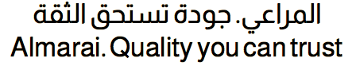

Almarai Open-Source Font

It is a distinctive modern Arabic typeface, available in four weights. 
The range was created following a modern geometric style 
while still respecting Arabic calligraphy rules. 

Its fluid geometry makes Almarai Fonts the perfect choice to use in both 
print and web applications, and alongside its matching Latin typefaces.

